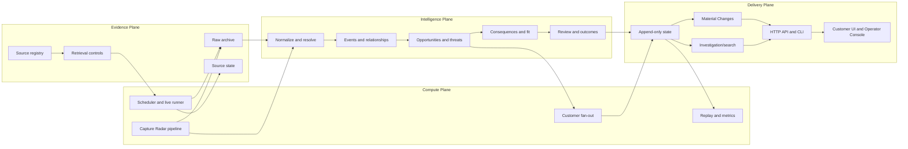
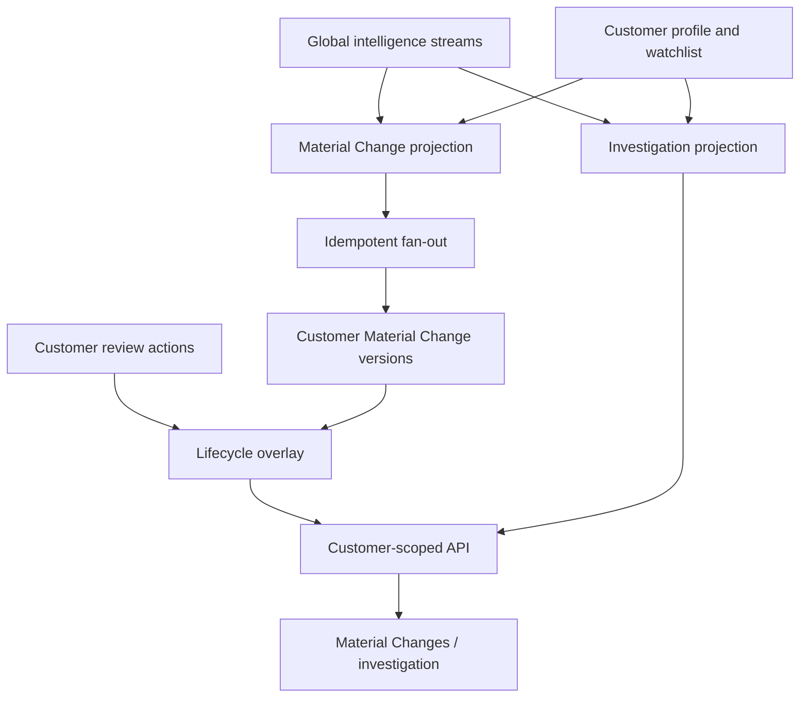

# System architecture

Status: descriptive; repository evidence controls  
Last reviewed: 2026-09-19

## Context and boundary

Pyrnova is currently a single Python package, static browser assets, a local HTTP host, a CLI, local
append-only state, and a content-addressed evidence archive. It is not a collection of independently
deployed services. `db/schema.sql` describes the intended PostgreSQL structured-store mirror, but the
runtime in this baseline does not use a PostgreSQL repository adapter.

The current Phase 1 application is customer-specific federal-contractor Material Changes. Capture Radar,
cross-source reasoning, consequence/fit, threat propagation, investigation, and replay are capabilities
inside the same system. Integrated Phase 1.5 industrial replay remains research/evaluation evidence,
not an implemented production plane.

The locked cross-phase product architecture is defined separately in
`../strategy/PLATFORM_PRODUCT_ARCHITECTURE.md`: shared **Core** and **PyrAI** layers support **Scout**,
**Strike**, **Vector**, and **Atlas**. Those are product/ownership boundaries, not claims that the current
Python package has already been split into services or four product runtimes. The current implementation
maps predominantly to the Strike-led Phase 1 workflow, while the existing planes provide shared Core
foundations and bounded capabilities that may support other products later.

The four products are not a mandatory execution sequence. Any future separation must preserve one
canonical shared truth for identity, evidence, provenance, time, rights and customer scope; it must not
clone the current planes into competing product-owned truth stores. PyrAI remains model-agnostic and
subordinate to those invariants.

## Planes



### Evidence Plane

- `pyrnova/sources/registry.py` is the machine-readable source manifest: identity, family, access,
  identifiers, retention, rights note, cadence, budget posture, reliability, and status.
- `pyrnova/sources/control.py` implements OFFLINE/LIVE_SAFE/ACCEPTANCE modes, request sanitization and
  deterministic fingerprinting, live-call budgets, retry metadata, metrics, and circuit breaking.
- `pyrnova/sources/source_state.py` persists per-source budget epoch, breaker state, checkpoint, metrics,
  and request-fingerprint-to-archive-hash index in atomic JSON files.
- `pyrnova/archive.py` retains exact bytes by SHA-256 under a local filesystem or optional S3-compatible
  backend and appends observation metadata. Content is immutable by address; an equal body reuses the
  same content object while recording another observation.
- Source adapters under `pyrnova/sources/` own source-specific requests and parsing. The archive and
  controls do not infer source meaning.

### Intelligence Plane

- `normalize.py`, `resolve.py`, `integrate.py`, and `enrich.py` turn source-shaped data into conservative,
  source-independent structures. Weak identity must remain unresolved or deferred.
- `models.py` holds the shared dataclasses used by engines. `db/schema.sql` is broader and includes a
  schema-only `claim` record and intended relational mirrors.
- `engines/recompete.py` and `engines/presolicitation.py` detect opportunity candidates.
- `chains.py`, `precursors.py`, and `transitions.py` model cross-source program progression and the time a
  disposition became supportable.
- `catalysts.py`, `capabilities.py`, `value.py`, `company.py`, `multisource.py`, and `fit.py` generate
  commercial consequences and evidence-backed capability fit without changing the Phase 1 score.
- `adverse_events.py`, `relationships.py`, `threat.py`, and `propagation.py` model observed adverse events,
  explicit exposure edges, threats, and bounded cross-company propagation.
- `review.py`, `review_queue.py`, and `outcomes.py` keep automated dispositions, human adjudication,
  deferred joins, predictions, and observed outcomes distinct.

### Compute Plane

- `pipeline.run` orchestrates already-fetched records through archive, normalize, detect, match, review,
  persistence, and report assembly. It is source-agnostic after inputs are supplied.
- `SourceScheduler` composes source registry, controls, durable source state, and archive. It performs no
  HTTP itself. A caller must explicitly provide a fetcher and live mode.
- `LiveRunner` supplies a narrow live driver and call-efficiency ledger. It does not bypass scheduler
  controls.
- `customer_material_changes.fan_out` evaluates global intelligence for each persisted customer,
  suppresses irrelevant rows, and appends customer-scoped versions only when material content changes.
- `replay.py`, `outcomes.py`, `metrics.py`, `threat_calibration.py`, and `selectivity.py` reconstruct and
  evaluate point-in-time behavior.

### Delivery Plane

- `StateStore` writes one append-only JSONL file per stream. This is the implemented development/runtime
  persistence path.
- `material_changes.py` creates the customer-specific read model. It separates observed facts,
  assessment, relevance, evidence references, uncertainty, lifecycle, outcome, and provenance.
- `customer_material_changes.py` materializes a durable customer-scoped projection and preserves version
  history. It does not copy evidence bodies or mutate global intelligence.
- `investigation.py` builds a point-in-time `IntelligenceEstate`, deterministic search, and company/
  program pages. It is a read projection, not a second canonical graph.
- `ops.py` is the application service. `ops_server.py` supplies the HTTP routes and static assets.
- `ops_web/` contains a customer Material Changes UI, investigation UI, access gate, and local Operator
  Console. `brief.py` renders Markdown output; `cli.py` exposes operator/developer commands.

## Major data flows

### Source to opportunity

```text
source request
→ sanitized fingerprint and source control
→ raw bytes archived
→ source-shaped parse/normalize
→ deterministic candidate detection
→ source-native dedupe identity
→ capability relevance and system disposition
→ optional human adjudication
→ opportunity, prediction, review, and metric streams
→ Signal Brief / Material Change projection
```

The pipeline can run from live source pages or fixtures. Fixture success is never described as fresh
source acceptance.

### Source to threat and consequence

```text
archived observation
→ evidence-backed event/catalyst
→ explicit entity/program relationship or exposure
→ commercial consequence or threat assessment
→ optional bounded propagation across accepted edges
→ global append-only streams
→ customer relevance
→ customer-scoped Material Change version
```

Propagation must not increase confidence and must retain path and evidence references. Name-only or
otherwise weak joins can be rejected or deferred instead of forced.

### Customer delivery



Global intelligence remains global. Customer profiles, watches, relevance, delivered versions, and
review actions remain customer-private. Customer actions cannot rewrite the system assessment.

## State ownership

| State | Implemented owner | Mutability |
|---|---|---|
| Raw evidence bytes | `EvidenceArchive` | Content immutable; observation metadata appended |
| Source budgets/checkpoints/cache index | `SourceStateStore` | Atomic document replacement per source |
| Global intelligence | `StateStore` streams written by engines/pipeline | Append-oriented; consumers select current/as-of records |
| Customer profile/watch/review | `customers.py` streams | Append-only versions/closures/actions |
| Customer Material Changes | `customer_material_changes.py` stream | Append-only content versions |
| Read projections | Material Changes and investigation builders | Derived; not authoritative persistence |
| Browser UI state | Static JS/session storage | Presentation/session only; never intelligence authority |
| Intended production records | `db/schema.sql` | Schema direction only in this baseline |

## Auth and tenant boundary

`access.py` authenticates a bearer credential into an `AuthContext`. `ops_server.py` derives the tenant
from that context, checks route level, and binds `OperatorConsole.access_check` to the current request as
defense in depth. Non-local binding always requires authentication and hides the Operator Console.
Isolation is application-layer; there are no database RLS policies. See
[`SECURITY_AND_TENANCY.md`](SECURITY_AND_TENANCY.md).

## Runtime and deployment boundary

Implemented:

- Python 3.10+ package and CLI;
- local filesystem archive or optional S3-compatible archive;
- append-only JSONL state and atomic per-source control files;
- threaded stdlib HTTP server and static assets;
- explicit remote-bind authentication interlock;
- deterministic offline test/replay paths.

Not implemented or not verified here:

- runtime PostgreSQL persistence despite the schema/optional dependency;
- database migrations, RLS, production edge/TLS, process supervision, centralized alerts, backups/
  restores, HA, or deployment manifests;
- a production queue/worker fabric;
- an unattended production soak or customer acceptance;
- Phase 1.5 production source/identity/relevance/scoring paths.

## Architectural invariants

Supported by code/tests:

- canonical/authoritative state is distinct from read projections;
- global intelligence is distinct from customer-private state;
- raw evidence is content-addressed and provenance-linked;
- source retrieval is offline-default and budget/cadence/breaker governed when using the scheduler;
- deterministic identity and explicit uncertainty are preferred over silent inference;
- future-dated evidence is excluded from point-in-time views;
- predictions and later outcomes remain separate;
- scoring policy identifiers are explicit and `scoring_v1` remains active;
- no runtime LLM is required for ordinary rendering or deterministic search.

See [`../adr/README.md`](../adr/README.md) for the rationale tied to existing decisions.
